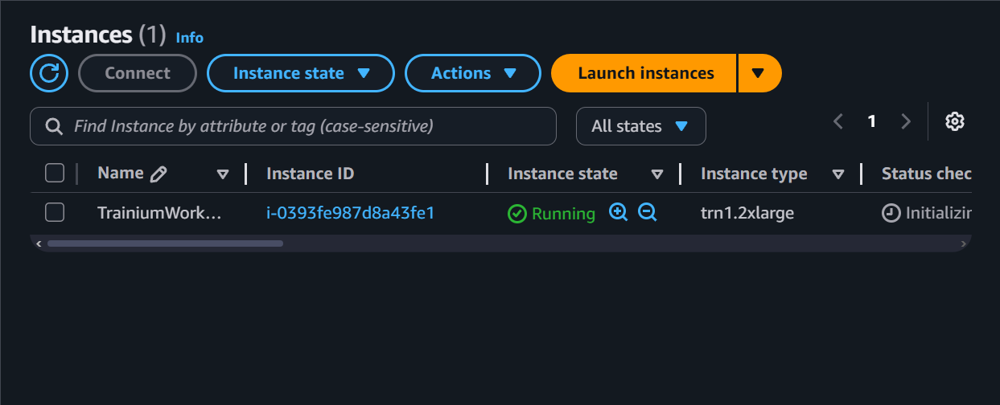
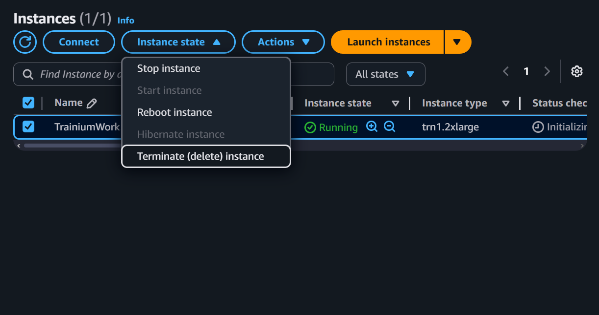

# AWS 101 for Trainium Development Workshop

## Introduction

This hands-on workshop helps you get started with AWS Trainium instances for machine learning development. AWS Trainium is a custom ML accelerator chip designed by AWS specifically for training deep learning models with high performance and cost efficiency. By the end of this one-hour session, you'll be able to set up a secure AWS environment, launch Trainium instances, and run basic ML workloads.

### What You'll Accomplish

By completing this workshop, you will:
- Create and secure an AWS environment for ML development
- Launch and connect to a Trainium instance
- Run your first ML workload on AWS Trainium
- Learn how to manage instances to control costs
- Set up a remote development environment

> **Note**: This guide is updated for April 2025 with the latest AWS Neuron SDK (version 2.22.0) and supports both Trn1 and the newer Trn2 instances.

## Prerequisites

- A laptop with internet connection
- An AWS account (new or existing) with appropriate permissions to create IAM users, EC2 instances, and security groups
- Basic familiarity with command line interfaces (Bash for Linux/macOS or PowerShell for Windows)
- Basic knowledge of Python and PyTorch (for the ML examples)
- Understanding of SSH for connecting to remote instances

If you're new to AWS, review the [AWS Getting Started Guide](https://aws.amazon.com/getting-started/) before beginning this workshop.

---

## 1. Setting Up Your AWS Environment

### Creating an IAM User

For security best practices, you should use an IAM user instead of your root account. This creates a user with limited permissions specific to the workshop needs:

1. Sign in to the [AWS Management Console](https://console.aws.amazon.com/) using your root credentials
2. Navigate to the IAM service (search for "IAM" in the top search bar)
3. In the left navigation panel, click "Users" and then "Create user"
4. Name your user (e.g., "trainium-workshop-user") and click "Next"
5. Select "Attach policies directly" and create a custom policy:

```json
{
    "Version": "2012-10-17",
    "Statement": [
        {
            "Effect": "Allow",
            "Action": [
                "ec2:*",
                "s3:*",
                "cloudwatch:*",
                "budgets:*",
                "pricing:*"
            ],
            "Resource": "*"
        }
    ]
}
```

> **Note**: In a production environment, you would use more restrictive permissions following the principle of least privilege. This policy is simplified for workshop purposes.

6. Click "Next" and then "Create user"

### Creating Access Keys for CLI

1. From the IAM dashboard, select your newly created user
2. Go to the "Security credentials" tab
3. Under "Access keys", click "Create access key"
4. Select "Command Line Interface (CLI)" as your use case
5. (Optional) Add a tag for better tracking (e.g., Key: Purpose, Value: TrainiumWorkshop)
6. Click "Create access key"
7. **IMPORTANT**: Download the .csv file or copy your Access Key ID and Secret Access Key - you won't be able to access the secret again!

### Creating a Key Pair for SSH

1. Navigate to EC2 in the AWS Console
2. In the left navigation panel, under "Network & Security", select "Key Pairs"
3. Click "Create key pair"
4. Name your key (e.g., "trainium-workshop-key")
5. For key pair type, choose "RSA"
6. For private key format: 
   - For macOS/Linux users: Choose .pem
   - For Windows users: Choose .ppk if using PuTTY, or .pem if using OpenSSH
7. Click "Create key pair" and save the file securely (usually in `~/.ssh/` directory)
8. Change permissions (for .pem on macOS/Linux):
   ```bash
   chmod 400 ~/.ssh/trainium-workshop-key.pem
   ```

> **Tips**:
> - Save this key in a secure location, as you'll need it to connect to your instances
> - If you lose this key, you won't be able to connect to your instances and will need to create new ones
> - Never share your private key with others

---

## 2. Installing and Configuring AWS Command Line Interface (CLI)

The AWS Command Line Interface (CLI) allows you to interact with AWS services from the terminal. This section covers installation and setup for different operating systems.

### For macOS

#### Using Homebrew (recommended)
```bash
# Install Homebrew if not already installed
/bin/bash -c "$(curl -fsSL https://raw.githubusercontent.com/Homebrew/install/HEAD/install.sh)"

# Install AWS CLI
brew install awscli

# Verify installation
aws --version
```

#### Using the official installer
```bash
# Download the installer
curl "https://awscli.amazonaws.com/AWSCLIV2.pkg" -o "AWSCLIV2.pkg"

# Install the package
sudo installer -pkg AWSCLIV2.pkg -target /

# Verify installation
aws --version
```

### For Windows using WSL (Recommended)

Windows Subsystem for Linux (WSL) provides a Linux environment that works better with developer tools:

1. Install WSL by opening PowerShell as Administrator and running:
```powershell
wsl --install
```

2. Once installed and rebooted, open the Ubuntu terminal from your Start menu
3. Update your Linux distribution:
```bash
sudo apt update && sudo apt upgrade -y
```

4. Install AWS CLI in WSL:
```bash
curl "https://awscli.amazonaws.com/awscli-exe-linux-x86_64.zip" -o "awscliv2.zip"
sudo apt-get install unzip
unzip awscliv2.zip
sudo ./aws/install
```

5. Verify installation:
```bash
aws --version
```

6. Your WSL environment will now behave like Linux for all AWS CLI commands in this guide

### For Windows (Native - Alternative)

If you prefer not to use WSL:

1. Download the MSI installer: [AWS CLI MSI Installer for Windows](https://awscli.amazonaws.com/AWSCLIV2.msi)
2. Run the downloaded MSI file and follow installation prompts
3. Open Command Prompt or PowerShell to verify installation:
```
aws --version
```

### Configuring the AWS CLI

After installing the AWS CLI, you need to configure it with your AWS credentials:

1. Open a terminal (or Command Prompt/PowerShell on Windows)
2. Run the following command:

```bash
aws configure
```

3. You'll be prompted to enter the following information:
   - AWS Access Key ID: [Enter your access key]
   - AWS Secret Access Key: [Enter your secret key]
   - Default region name: us-west-2
   - Default output format: json

4. If you don't have access keys yet, create them in the IAM service after creating your IAM user (see Section 1)

5. Verify your configuration:
```bash
aws sts get-caller-identity
```

6. You should see output similar to:
```json
{
    "UserId": "AIDAXXXXXXXXXXXXXXXX",
    "Account": "123456789012",
    "Arn": "arn:aws:iam::123456789012:user/trainium-workshop-user"
}
```

7. Create a credentials file backup (optional but recommended):
```bash
# For macOS/Linux/WSL
cp ~/.aws/credentials ~/.aws/credentials.backup

# For Windows (PowerShell)
Copy-Item -Path "$env:USERPROFILE\.aws\credentials" -Destination "$env:USERPROFILE\.aws\credentials.backup"
```

---

## 3. Launching a Trainium Instance

### Creating a Security Group

Security best practice: We'll create a security group that only allows SSH access from your current IP address:

```bash
# Create a security group for Trainium instances
aws ec2 create-security-group \
    --group-name trainium-workshop-sg \
    --description "Security group for Trainium workshop" \
    --output json

# Get your public IP to restrict SSH access (security best practice)
MY_IP=$(curl -s https://checkip.amazonaws.com)
echo "Your public IP: $MY_IP (SSH access will be restricted to this IP only)"

# Allow SSH access from your IP only for better security
aws ec2 authorize-security-group-ingress \
    --group-name trainium-workshop-sg \
    --protocol tcp \
    --port 22 \
    --cidr $MY_IP/32
```

> **Security Note**: The above command restricts SSH access to your current public IP address only (`$MY_IP/32`). If your IP address changes (e.g., connecting from a different network), you'll need to update the security group rule by running these commands:
> 
> ```bash
> # Get your new public IP address
> NEW_IP=$(curl -s https://checkip.amazonaws.com)
> echo "Your new public IP: $NEW_IP"
> 
> # First, get your security group ID
> SG_ID=$(aws ec2 describe-security-groups \
>     --group-names trainium-workshop-sg \
>     --query "SecurityGroups[0].GroupId" \
>     --output text)
> 
> # Then, add a new rule for your current IP
> aws ec2 authorize-security-group-ingress \
>     --group-id $SG_ID \
>     --protocol tcp \
>     --port 22 \
>     --cidr $NEW_IP/32
> ```

### Launching Your Trainium Instance

```bash
# Launch a Trainium instance
aws ec2 run-instances \
    --image-id ami-0247d9b336deb7718 \
    --instance-type trn1.2xlarge \
    --count 1 \
    --key-name trainium-workshop-key \
    --security-groups trainium-workshop-sg \
    --tag-specifications 'ResourceType=instance,Tags=[{Key=Name,Value=TrainiumWorkshop}]' \
    --output json
```

Save the `InstanceId` from the output for later use:

```bash
# Save the instance ID to a variable
export INSTANCE_ID=$(aws ec2 describe-instances \
    --filters "Name=tag:Name,Values=TrainiumWorkshop" "Name=instance-state-name,Values=pending,running" \
    --query "Reservations[0].Instances[0].InstanceId" \
    --output text)

# Verify that the instance ID was captured correctly
echo "Instance ID: $INSTANCE_ID"
```

```bash
# Get security group ID
export SECURITY_GROUP_ID=$(aws ec2 describe-security-groups \
    --group-names trainium-workshop-sg \
    --query "SecurityGroups[0].GroupId" \
    --output text)

echo "Security Group ID: $SECURITY_GROUP_ID"
```

## 4. Connecting to your instance

### Getting Instance Information

```bash
# Find your instance's public IP
aws ec2 describe-instances \
    --filters "Name=tag:Name,Values=TrainiumWorkshop" "Name=instance-state-name,Values=running" \
    --query "Reservations[*].Instances[*].[InstanceId,PublicIpAddress,State.Name]" \
    --output table

# Save the public IP address to an environment variable for easier use
export INSTANCE_IP=$(aws ec2 describe-instances \
    --filters "Name=tag:Name,Values=TrainiumWorkshop" "Name=instance-state-name,Values=running" \
    --query "Reservations[0].Instances[0].PublicIpAddress" \
    --output text)

# Verify it was captured correctly
echo "Instance IP: $INSTANCE_IP"

# You can now use $INSTANCE_IP in other commands, like SSH:
# ssh -i ~/.ssh/trainium-workshop-key.pem ubuntu@$INSTANCE_IP
```

### SSH to Your Instance

For macOS/Linux:
```bash
# Using the saved IP variable
ssh -i ~/.ssh/trainium-workshop-key.pem ubuntu@$INSTANCE_IP

# Or directly with the IP address
ssh -i ~/.ssh/trainium-workshop-key.pem ubuntu@<your-instance-ip>
```

For Windows using PowerShell with OpenSSH:
```powershell
# Using the saved IP variable (if you set it in PowerShell)
ssh -i C:\path\to\trainium-workshop-key.pem ubuntu@$env:INSTANCE_IP

# Or directly with the IP address
ssh -i C:\path\to\trainium-workshop-key.pem ubuntu@<your-instance-ip>
```

For Windows using PuTTY:
1. Open PuTTY
2. Enter your instance's IP address in the "Host Name" field
3. Navigate to Connection > SSH > Auth
4. Browse to your .ppk key file
5. Click "Open" to connect

### Copying Files to/from Your Instance (SCP)

To copy a local file to your instance:
```bash
# Using the saved IP variable
scp -i ~/.ssh/trainium-workshop-key.pem /path/to/local/file ubuntu@$INSTANCE_IP:/path/on/remote/machine

# Or directly with the IP address
scp -i ~/.ssh/trainium-workshop-key.pem /path/to/local/file ubuntu@<your-instance-ip>:/path/on/remote/machine
```

To copy a file from your instance to your local machine:
```bash
# Using the saved IP variable
scp -i ~/.ssh/trainium-workshop-key.pem ubuntu@$INSTANCE_IP:/path/on/remote/machine /path/to/local/destination

# Or directly with the IP address
scp -i ~/.ssh/trainium-workshop-key.pem ubuntu@<your-instance-ip>:/path/on/remote/machine /path/to/local/destination
```

Test to see if you have logged into a Trainium enabled machine:

```bash
# Activate the Neuron environment for PyTorch (use the latest available environment)
source /opt/aws_neuronx_venv_pytorch_2_9/bin/activate

# Verify Neuron installations
neuron-ls
```

You should see output similar to:
```
instance-type: trn1.2xlarge
instance-id: i-0123456789abcdef
+--------+--------+--------+---------+
| NEURON | NEURON | NEURON | PCI     |
| DEVICE | CORES  | MEMORY | BDF     |
+--------+--------+--------+---------+
| 0      | 2      | 32 GB  | 00:1e.0 |
+--------+--------+--------+---------+
```

Terminate your instance using the following command:
```bash
# Terminate instance
aws ec2 terminate-instances --instance-ids $INSTANCE_ID
```
---

## 5. Automating login
The process to log in to your AWS instance can be automated using an ssh proxy
command.

Add the follwing to your ssh config file (`~/.ssh/config`):
```ssh-config
Host aws-trainium
  ProxyCommand /path/to/aws-ssh
  User ubuntu
  IdentityFile ~/.ssh/u<identity-file>.pem
```
Place the [aws-ssh](aws-ssh) file in a convenient place and set its
permissoins by using `chmod u+x /path/to/aws-ssh`.

Then you should be able to log in to your Trainium instance by runninng:
```bash
ssh aws-trainium
```

This script takes care of setting the ingress rule for your current IP address
and finding the IP address of your instance. What this script does not do is 
start, stop or terminate your instance. You will need to do that yourself.

## 6. Ending your instances
You can use this link to check your running instances: https://us-west-2.console.aws.amazon.com/ec2/home?region=us-west-2#Instances

You can see your running instances like this:


You can use the "Instance state" option to close your instance:


When you terminate an instance, it should shutdown then will transition to the "terminated" state. It will eventually disappear from your instances.

You can also hibernate an instance. This will keep the state of your machine, but will continue to use AWS storage resources, but not compute resources. Terminating an instance won't use any resources.

## 7. Instance Management

```bash
# List available Trainium instance types
aws ec2 describe-instance-type-offerings \
    --filters Name=instance-type,Values=trn1*,trn2* \
    --output table

# Stop instance
aws ec2 stop-instances \
    --instance-ids $INSTANCE_ID

# Start instance
aws ec2 start-instances \
    --instance-ids $INSTANCE_ID

# Terminate instance
aws ec2 terminate-instances \
    --instance-ids $INSTANCE_ID
```

> **Important**: Always terminate instances you no longer need to avoid unexpected charges. For temporary pauses in work, stopping is more appropriate than terminating, as you'll retain your data and configuration.
